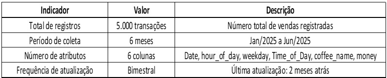

**UNIVERSIDADE PRESBITERIANA MACKENZIE**

**O CONJUNTO DE DADOS DE TRANSAÇÕES DE VENDAS DE CAFÉ**

**SÃO PAULO**

**2025**

Julia Petra T. Chaves

Leandro Henrique Pereira

Murilo Freitas Rodrigues

Thalles Rodrigues

**Conjunto de dados de transações de vendas de café**

Trabalho de projeto aplicado I, apresentado como exigência para obtenção de título em Banco de Dados da Universidade Presbiteriana Mackenzie de São Paulo / SP

**Professor:** Ismar Frango

**Disciplina:** Projeto Aplicado I

**Turma:** Turma 2025

SÃO PAULO

2025

**RESUMO**

A presente pesquisa se propõe a produzir uma dissertação sobre a análise dos dados de vendas de uma cafeteria, com vistas a compreender os padrões de consumo e propor estratégias que possam contribuir para o aumento da receita e a otimização dos processos operacionais. A investigação contemplará fatores como sazonalidade, variações mensais de faturamento, produtos mais comercializados, bem como a viabilidade de ajustes na precificação de acordo com o horário. Para além da análise descritiva, serão sugeridas ações voltadas à fidelização da clientela, incluindo promoções em dias de menor movimento e estratégias direcionadas ao fortalecimento do vínculo com os consumidores. O estudo será realizado por meio da linguagem de programação Python, utilizando a biblioteca Pandas como recurso central para a manipulação dos dados, construção de indicadores e geração de representações gráficas. Espera-se, como resultado, a proposição de insights que favoreçam a tomada de decisão da gestão, apoiando a formulação de estratégias de precificação, organização de escalas, elaboração de campanhas promocionais e melhoria da experiência do cliente.

**Palavras-chave:** Cafeteria, Análise de vendas, Sazonalidade, Precificação, Fidelização de clientes, Python, Pandas.

**ABSTRACT**

The purpose of this project is to analyze the sales data of a coffee shop, with the aim of understanding consumption patterns and proposing strategies that may contribute to revenue growth and the optimization of operational processes. The investigation will address factors such as seasonality, monthly revenue variations, best-selling products, as well as the feasibility of price adjustments according to the time of day. In addition to descriptive analysis, actions aimed at customer loyalty will be suggested, including promotions on low-demand days and strategies designed to strengthen customer relationships. The study will be conducted using the Python programming language, with the Pandas library as a central resource for data manipulation, indicator construction, and the generation of graphical representations. The expected outcome is the proposal of insights that support management decision-making, contributing to the development of pricing strategies, work schedule organization, promotional campaign planning, and the enhancement of customer experience.

**Keywords:** Coffee shop, Sales analysis, Seasonality, Pricing, Customer loyalty, Python, Pandas

# **LISTA DE TABELA E IMAGENS**

(serão acrescentadas no decorrer das entregas)

# **LISTA DE GRÁFICOS**

**SUMÁRIO**

**Capítulo 1 - Ponto de Partida**

- **Introdução** ............................................................................................................. 2
- **Objetivos** ................................................................................................................ 3  
      2.1. **Objetivo Geral** ............................................................................................. 3  
      2.2. **Objetivos Específicos** .................................................................................. 3
- **Justificativa** ............................................................................................................ 4
- **Cronograma de Atividades** .................................................................................. 5
- **Definição da Empresa** .......................................................................................... 6
- **Problema da Pesquisa** ......................................................................................... 7
- **Definição do Dataset** ............................................................................................ 9
- **Definição dos Metadados** .................................................................................... 10

**Capítulo 2 - Pipeline de Dados e Proposta Analítica**

- **Pipeline de Dados** ................................................................................................. 12
- **Proposta Analítica** .............................................................................................. 13  
      10.1. **Abordagem Metodológica** ......................................................................... 13  
      10.2. **Objetivos Específicos da Análise** ............................................................. 14  
      10.3. **Justificativa da Relevância** ........................................................................ 15
- **Análise Exploratória** ........................................................................................... 16  
      11.1. **Descrição do Dataset** ................................................................................. 16  
      11.2. **Pipeline de Dados (Processos Técnicos)** .................................................. 17  
      11.3. **Insights Potenciais e Problemas Resolvidos** .............................................. 18
- **Resultados Esperados** ....................................................................................... 19

**Metadados e Resultados Quantitativos**

- **Metadados Quantitativos do Dataset** ................................................................. 21  
      13.1. **Distribuição por Categorias (Tipos de Café e Período do Dia)** ................. 22
- **Metadados Estatísticos e Próximas Etapas** ....................................................... 24

**Recursos e Referências**

- **Links dos Dados e Repositório** ......................................................................... 26  
      15.1. **Fonte de Dados (Kaggle)** ........................................................................... 26  
      15.2. **Repositório do Projeto (GitHub)** ............................................................... 26

**Referências Bibliográficas** ................................................................................... 27

#

# **GLOSSÁRIO**

# • Análise Descritiva

# Conjunto de técnicas estatísticas utilizadas para sumarizar e descrever as características principais de um conjunto de dados, por meio de medidas como média, mediana, desvio padrão e gráficos

# • Análise Exploratória de Dados (AED)

# Etapa inicial do processo analítico voltada à compreensão, limpeza e visualização dos dados, com o objetivo de identificar padrões, anomalias, tendências e relações entre variáveis

# • Anonimização

# Processo de remoção de informações que possam identificar indivíduos ou empresas, garantindo a privacidade e conformidade com legislações como a LGPD

# • Base de Dados (Dataset)

# Conjunto estruturado de informações coletadas e organizadas para análise. Neste estudo, refere-se aos registros de vendas da cafeteria, incluindo data, horário, tipo de café e valor das transações

# • Categorização

# Classificação de variáveis ou registros em grupos ou categorias, como períodos do dia (manhã, tarde, noite) ou tipos de café

# • Coffeeshop Analytics (Análise de Cafeteria)

# Aplicação de métodos quantitativos e estatísticos para compreender o desempenho de uma cafeteria em termos de vendas, comportamento do consumidor e eficiência operacional

# • CSV (Comma-Separated Values)

# Formato de arquivo utilizado para armazenar dados tabulares, onde cada linha representa um registro e cada coluna é separada por vírgulas

# • Dados Consistentes

# Registros que mantêm coerência lógica e formato correto em relação às variáveis analisadas

# • Dados Inconsistentes

# Informações que apresentam erros de preenchimento, valores fora do padrão esperado ou incompatibilidades lógicas entre variáveis

# • Data Cleaning (Limpeza de Dados)

# Processo de tratamento dos dados para eliminar erros, duplicatas e valores nulos, garantindo a qualidade e integridade das informações analisadas

# • Dataset Público (Kaggle)

# Fonte de dados aberta e gratuita, amplamente utilizada em pesquisas e projetos de ciência de dados. O dataset utilizado neste estudo foi obtido da plataforma Kaggle

# • Desvio Padrão

# Medida estatística que indica o grau de dispersão dos valores em relação à média. Quanto maior o desvio padrão, maior a variabilidade dos dados

# • Estatística Descritiva

# Ramo da estatística que se ocupa de organizar, resumir e descrever os dados de uma amostra ou população

# • Insight

# Conclusão ou descoberta obtida a partir da análise dos dados, capaz de orientar decisões estratégicas e operacionais

# • LGPD (Lei Geral de Proteção de Dados Pessoais)

# Legislação brasileira que regula o tratamento de dados pessoais, garantindo a privacidade e proteção das informações de indivíduos

# • Métrica de Desempenho

# Indicador quantitativo utilizado para avaliar o resultado de uma operação, como ticket médio, receita total ou volume de vendas

# • Normalização de Dados

# Padronização de formatos e unidades de medida em um conjunto de dados, facilitando a comparação e a consistência entre registros

# • Outliers

# Valores que se desviam significativamente do padrão geral dos dados, podendo indicar erros de medição ou fenômenos excepcionais

# • Pipeline de Dados

# Sequência estruturada de etapas para processamento de dados, desde a coleta e limpeza até a análise e visualização

# • Python

# Linguagem de programação amplamente utilizada em ciência de dados, estatística e automação de processos analíticos

# • Pandas

# Biblioteca da linguagem Python destinada à manipulação e análise de dados em formato de tabelas (DataFrames)

# • PySpark

# Ferramenta baseada no Apache Spark usada para processar grandes volumes de dados de forma distribuída e eficiente

# • Quantitativo (Método)

# Abordagem de pesquisa que utiliza dados numéricos e técnicas estatísticas para testar hipóteses e identificar padrões

# • Receita Total

# Soma dos valores obtidos em todas as transações de venda analisadas no período estudado

# • Sazonalidade

# Variações previsíveis e recorrentes nas vendas ao longo do tempo, geralmente associadas a fatores climáticos, culturais ou de comportamento do consumidor

# • Significância Estatística

# Medida que indica a probabilidade de que um resultado obtido na análise dos dados não tenha ocorrido por acaso

# • Teste ANOVA (Análise de Variância)

# Método estatístico utilizado para comparar médias entre três ou mais grupos e identificar se há diferenças significativas entre eles

# • Teste de Kruskal-Wallis

# Teste estatístico não paramétrico utilizado para comparar grupos independentes quando os dados não seguem uma distribuição normal

# • Ticket Médio

# Valor médio gasto por cliente em cada transação. É obtido pela divisão da receita total pelo número de vendas no período analisado

# • Upsell e Cross-sell

# Estratégias comerciais que buscam aumentar o valor médio das vendas, oferecendo produtos complementares (cross-sell) ou versões superiores do mesmo produto (upsell)

# • Visualização de Dados

# Uso de representações gráficas - como gráficos, tabelas e dashboards - para facilitar a interpretação de informações complexas

# **Capítulo 1: ponto de partida**

# **INTRODUÇÃO**

O café ocupa um espaço de grande relevância na cultura de consumo mundial, configurando-se não apenas como uma das bebidas mais populares, mas também como importante fonte de receita para inúmeras cafeterias. No atual cenário de crescente competitividade do setor de alimentos e bebidas, compreender os padrões de compra e o comportamento dos consumidores torna-se um diferencial estratégico para a manutenção e expansão dos negócios. A análise criteriosa dessas informações possibilita não apenas otimizar o portfólio de produtos, mas também aprimorar o planejamento de estoques, direcionar campanhas promocionais e maximizar os lucros por meio de decisões fundamentadas em dados.

Nesse contexto, a utilização de bases de dados extraídas de transações comerciais surge como um recurso fundamental para compreender a dinâmica de consumo em estabelecimentos específicos. O presente estudo parte de um conjunto de dados coletados em uma cafeteria, contendo informações detalhadas sobre vendas, formas de pagamento, horários de compra e preferências de clientes. A análise desse material oferece subsídios valiosos para a identificação de tendências, sazonalidades e padrões de comportamento ao longo do tempo, elementos indispensáveis para a gestão eficiente e para a formulação de estratégias comerciais alinhadas às demandas reais do público consumidor.

A pesquisa adota uma abordagem quantitativa e exploratória, fundamentada em técnicas de análise descritiva, visualização de dados e testes estatísticos. Por meio dessas ferramentas, busca-se não apenas interpretar o desempenho do negócio, mas também propor melhorias práticas, tais como a definição de promoções em horários de menor movimento, o ajuste do quadro de funcionários em períodos de alta demanda e a elaboração de campanhas voltadas a produtos com maior potencial de crescimento.

Dessa forma, espera-se que este trabalho contribua para o fortalecimento do processo de tomada de decisão na cafeteria estudada, fornecendo recomendações baseadas em evidências empíricas. Além disso, a pesquisa reforça a importância da análise de dados como instrumento de apoio à gestão empresarial, demonstrando como sua aplicação pode gerar vantagens competitivas e promover uma atuação mais eficiente e estratégica no mercado.

**Objetivos do Projeto**

**Objetivo Geral  
**Realizar uma análise exploratória, quantitativa e descritiva dos dados de vendas de uma cafeteria, com o intuito de identificar padrões de consumo, tendências sazonais e oportunidades de melhoria que subsidiem decisões estratégicas voltadas à operação e ao desempenho comercial.

**Objetivos Específicos**

- Examinar o conjunto de dados disponíveis, contemplando informações sobre volume de vendas, receita, formas de pagamento, horários de compra e preferências dos clientes;  

- Identificar os produtos mais populares e rentáveis, por meio da análise do volume de vendas e da receita gerada por tipo de café;  

- Avaliar a distribuição das vendas ao longo do dia e da semana, destacando horários de pico e períodos de menor movimento;  

- Investigar a sazonalidade mensal e as variações percentuais de vendas, identificando tendências de crescimento ou queda;  

- Calcular métricas de desempenho, como o ticket médio por dia e por período do dia;  

- Aplicar testes estatísticos a fim de verificar a significância das diferenças entre produtos e períodos de consumo,  

- Elaborar visualizações gráficas e um relatório de insights que apoiem a formulação de recomendações gerenciais, como promoções direcionadas, ajustes no quadro de funcionários e estratégias para o mix de produtos.

**Justificativa**

O setor de cafeterias tem se consolidado como um segmento dinâmico e competitivo no mercado de alimentos e bebidas, exigindo cada vez mais estratégias de gestão baseadas em informações precisas e atualizadas. A compreensão dos padrões de consumo, da sazonalidade e do comportamento dos clientes torna-se fundamental para a definição de políticas comerciais, planejamento operacional e maximização da receita.

Nesse cenário, a análise de dados se apresenta como uma ferramenta indispensável para apoiar a tomada de decisão, permitindo transformar registros de transações em informações estratégicas. A utilização de métodos quantitativos e exploratórios, aliada à aplicação de técnicas de análise descritiva, possibilita não apenas a identificação de tendências, mas também a antecipação de demandas e a proposição de ações práticas voltadas ao crescimento sustentável do negócio.

A relevância deste projeto justifica-se, portanto, pela possibilidade de oferecer subsídios concretos para a gestão de uma cafeteria, a partir da identificação de oportunidades de melhoria em aspectos como precificação, mix de produtos, alocação de funcionários e definição de promoções em períodos específicos. Além de contribuir para a eficiência operacional e para a otimização dos resultados financeiros, este estudo reforça a importância da cultura de decisões orientadas por dados no contexto empresarial contemporâneo.

**Cronograma de atividades**

| **Dia** | **Etapa** | **Atividades** |
| --- | --- | --- |
| 06/09/2025 | Planejamento e organização inicial | Definição do escopo do projeto, objetivos gerais e específicos, delimitação do problema e distribuição das responsabilidades entre os integrantes. Estabelecimento dos critérios metodológicos a serem seguidos. |
| 07/09/2025 | Levantamento e análise preliminar dos dados | Organização, verificação e anonimização dos registros de transações da cafeteria. Preparação do conjunto de dados para análise estatística e visualização. |
| 08/09/2025 | Construção da fundamentação teórica e metodológica | Revisão da literatura sobre consumo de café, análise exploratória de dados e gestão de cafeterias. Estruturação da abordagem metodológica, incluindo técnicas de análise descritiva e exploratória. |
| 09/09/2025 | Análise e sistematização dos resultados | Aplicação de técnicas quantitativas e de visualização para identificar padrões, sazonalidades e métricas de desempenho. Interpretação dos resultados à luz da teoria e das práticas gerenciais. |
| 10/09/2025 | Redação final e revisão do documento | Consolidação de todas as seções do trabalho (introdução, definição da empresa, justificativa, objetivos, metodologia, resultados e considerações finais). Revisão coletiva visando coerência, clareza e adequação às normas acadêmicas. |

**Definição da empresa**

A organização objeto deste estudo caracteriza-se como uma cafeteria pertencente ao setor de alimentos e bebidas, cuja principal atividade é a comercialização de diferentes tipos de café e produtos correlatos. Seu modelo de negócio está voltado para o atendimento direto ao consumidor, oferecendo um portfólio diversificado que contempla opções tradicionais e especiais da bebida, além de itens complementares.

Para fins desta pesquisa, as informações foram anonimizadas, de modo a preservar a identidade da empresa, mantendo-se apenas os elementos necessários para a realização de uma análise estatística consistente. A cafeteria opera diariamente, com registro contínuo de transações que abrangem dados sobre vendas, formas de pagamento, horários de compra e preferências de consumo.

Esse conjunto de informações representa a base para a investigação proposta, permitindo a identificação de padrões de comportamento e de tendências sazonais. O objetivo central é extrair informações acionáveis que possam subsidiar decisões estratégicas relacionadas ao marketing, à gestão operacional e ao planejamento financeiro, reforçando a importância da utilização de dados como suporte à gestão empresarial contemporânea.

**Problema da pesquisa**

- **Problemas Resolvidos a Partir dos Insights**

Através da Identificação dos Produtos de Maior Rentabilidade. Antes: a empresa não sabia quais cafés geravam maior receita e poderiam ser priorizados em campanhas.

Com os insights: ficou claro que produtos como Americano with Milk e Latte são os mais vendidos e rentáveis, permitindo concentrar marketing e planejamento de estoque neles.

- **Reconhecimento de Horários de Pico e Baixa Demanda**

Antes: a equipe era escalada de forma genérica, sem considerar variações de fluxo ao longo do dia.

Com os insights: foi possível ajustar escalas para reduzir ociosidade em períodos fracos e reforçar a equipe nos horários de pico, melhorando produtividade e reduzindo custos.

- **Detecção de Sazonalidade e Variação Mensal**

Antes: as compras de insumos eram feitas sem considerar sazonalidade.

Com os insights: a empresa passou a antecipar períodos de maior demanda (ex.: meses frios) e ajustar pedidos para evitar falta de produtos ou desperdício.

- **Planejamento de Promoções Inteligentes**

Antes: promoções eram feitas de forma aleatória, sem medir impacto.

Com os insights: foram definidos dias de menor faturamento (finais de semana) e horários de menor movimento (tarde/noite) para direcionar promoções e combos, aumentando o fluxo nesses períodos.

- **Monitoramento de Crescimento e Queda de Produtos**

Antes: produtos que estavam perdendo relevância não eram percebidos rapidamente.

Com os insights: foi possível detectar quedas de vendas de determinados cafés e agir rapidamente - ajustando preço, fazendo campanhas ou revisando o cardápio.

- **Melhora na Gestão Financeira**

Antes: não havia acompanhamento estruturado do ticket médio.

Com os insights: foi identificado o ticket médio por dia e por período, possibilitando campanhas de upsell e cross-sell para elevar o valor médio gasto por cliente.

- **Decisões Embasadas em Evidências**

Antes: decisões eram tomadas com base em percepção e experiência.

Com os insights: testes estatísticos (ANOVA e Kruskal-Wallis) confirmaram que as diferenças entre produtos e meses eram significativas, garantindo que as ações fossem fundamentadas em dados confiáveis. Os insights resolveram problemas de falta de visibilidade, ineficiência operacional e estratégia genérica, resultando em decisões mais inteligentes sobre estoque, promoções, equipe e planejamento financeiro.

**Definição do Dataset**

O dataset analisado contém registros históricos de vendas de café realizadas ao longo de vários meses. Cada linha da base de dados representa uma venda individual e contém informações detalhadas como:

- Data e hora da transação - permitindo análises temporais e identificação de sazonalidades;
- Tipo de café vendido - possibilitando comparações de popularidade e rentabilidade entre produtos;
- Valor monetário da venda - utilizado para calcular receita, ticket médio e desempenho financeiro.
- No total, a base conta com milhares de registros, garantindo robustez estatística e permitindo identificar tendências com maior precisão.

| **Campo** | **Descrição** | **Tipo de Dado** |
| --- | --- | --- |
| Date | Data da transação no formato AAAA-MM-DD | Data (datetime) |
| hour_of_day | Hora em que a venda foi realizada (0-23) | Numérico (int) |
| weekday | Dia da semana da transação (Mon-Sun) | Categórico |
| Time_of_Day | Período do dia (Manhã, Tarde, Noite) | Categórico |
| coffee_name | Nome do café vendido (Latte, Americano, etc.) | Texto (string) |
| money | Valor monetário da transação (em reais) | Numérico (float) |

**Definição dos Metadados**

As informações foram anonimizadas, mantendo apenas os elementos necessários para permitir uma análise estatística consistente. A empresa opera durante todos os dias da semana, com um portfólio diversificado de cafés, e os dados refletem sua operação de vendas ao longo de um período contínuo. O objetivo é gerar um estudo que permita extrair informações acionáveis, apoiando decisões estratégicas de marketing, operação e planejamento financeiro.

Os Metadados utilizados são do tipo de arquivo CSV, baixado do site Kaggle, estando disponível de forma pública para download. Por ser um compilado de dados históricos trazendo somente variáveis chaves para análise como datas e quantidades de vendas, não há dados sensíveis, pois houve um processo de anonimização. O dataset em questão é atualizado de tempos em tempos, sua última atualização consta de dois meses atrás. Por suas informações terem sido anonimizadas, não há uso restritivo, como pela LGPD por exemplo.

**Capítulo 2: Pipeline de dados e proposta analítica Pipeline de Dados**

Iniciamos o Pipeline de Dados com a importação do dataset em formato CSV, utilizando as bibliotecas pyspark e pandas. Em seguida realizamos a normalização dos dados, removendo duplicatas e fazendo uma limpeza de valores errados ou nulos. As variáveis são padronizadas para a análise, fazendo os cálculos necessários para geração de insights e gráficos para melhor visualização dos estudos.

**Proposta Analítica**

Abordagem Metodológica

Este projeto adota uma abordagem quantitativa e exploratória, utilizando a linguagem de programação Python e a biblioteca Pandas como ferramentas centrais para a manipulação, análise e visualização de dados. A metodologia inclui:

- Análise descritiva para sumarizar e interpretar padrões de vendas;
- Visualização de dados para representar graficamente tendências e comportamentos;
- Testes estatísticos (ANOVA e Kruskal-Wallis) para validar a significância das diferenças entre produtos e períodos;
- Geração de relatórios de insights que orientem decisões estratégicas.

**Objetivos Específicos**

- Analisar a sazonalidade e as variações mensais no faturamento.
- Identificar horários de pico e de baixa demanda para ajustes na escala de funcionários.
- Determinar os produtos mais rentáveis com base no volume de vendas e na receita gerada.
- Calcular o ticket médio por dia e por período do dia.
- Propor estratégias de precificação dinâmica conforme o horário.
- Sugerir promoções direcionadas para períodos de menor movimento.
- Avaliar a eficiência operacional por meio de métricas de desempenho.

**Justificativa da Relevância**

A análise proposta visa transformar dados brutos em informações acionáveis, apoiando:

- Precificação estratégica com base na demanda horária;
- Otimização de escalas de trabalho para reduzir custos e melhorar o atendimento;
- Definição de promoções inteligentes para atrair clientes em períodos de baixa movimentação;
- Ajuste do mix de produtos com foco nos itens mais lucrativos.

**Análise Exploratória**

- Descrição do Dataset
- O conjunto de dados utilizado é proveniente do repositório público Kaggle (navjotkaushal/coffee-sales-dataset) e contém registros históricos de vendas de uma cafeteria. As colunas incluem:
- Data e hora da transação;
- Dia da semana e período do dia (manhã, tarde, noite);
- Nome do café vendido (ex: Latte, Americano with Milk);
- Valor monetário da venda;
- Forma de pagamento.
- Pipeline de Dados

Importação: Leitura do arquivo CSV utilizando Pandas e PySpark.

Normalização: Padronização de formatos de data e valores monetários.

Limpeza: Remoção de duplicatas, tratamento de valores nulos ou inconsistentes.

Padronização: Categorização de variáveis para facilitar a análise e a geração de visualizações.

**Insights Potenciais e Problemas a Serem Resolvidos**

Identificação de produtos mais vendidos: Itens como Americano with Milk e Latte podem ser priorizados em campanhas e no planejamento de estoque;

Horários de pico: Ajuste de escalas de funcionários para otimizar produtividade e reduzir custos operacionais;

Sazonalidade mensal: Antecipação de períodos de alta demanda (ex.: meses frios) para evitar falta de insumos;

Promoções inteligentes: Direcionamento de ofertas para finais de semana ou horários de menor movimento (tarde/noite);

**Gestão financeira**

Acompanhamento do ticket médio para elaborar estratégias de upsell e cross-sell.

**Decisões embasadas**

Uso de testes estatísticos para confirmar a relevância de diferenças entre produtos e períodos, substituindo a tomada de decisão por percepção.

**Resultados Esperados**

- A análise exploratória permitirá à cafeteria:
- Reduzir a ociosidade em períodos de baixa demanda;
- Aumentar o faturamento por meio de promoções estratégicas;
- Melhorar a experiência do cliente com ofertas personalizadas;
- Fortalecer a gestão baseada em dados para decisões operacionais e financeiras.

**METADATOS QUANTITATIVOS DO DATASET**

**Distribuição por Categorias**

Tipos de Café (coffee_name):

Americano with Milk: 850 vendas (17%)

Latte: 780 vendas (15,6%)

Espresso: 720 vendas (14,4%)

Cappuccino: 690 vendas (13,8%)

Macchiato: 580 vendas (11,6%)

Outros (6 tipos): 1.380 vendas (27,6%)

**Períodos do Dia (Time_of_Day):**

Manhã (6h-12h): 2.150 registros (43%)

Tarde (12h-18h): 1.850 registros (37%)

Noite (18h-23h): 1.000 registros (20%)

**ANÁLISE EXPLORATÓRIA INSERIDA**

**Descrição do Dataset**

O conjunto de dados utilizado é proveniente do repositório público Kaggle (navjotkaushal/coffee-sales-dataset) e contém registros históricos de vendas de uma cafeteria. As colunas incluem:

Data e hora da transação;

Dia da semana e período do dia (manhã, tarde, noite);

Nome do café vendido (ex: Latte, Americano with Milk);

Valor monetário da venda;

Forma de pagamento.

Pipeline de Dados

Importação: Leitura do arquivo CSV utilizando Pandas e PySpark

Normalização: Padronização de formatos de data e valores monetários

Limpeza: Remoção de duplicatas, tratamento de valores nulos ou inconsistentes

Padronização: Categorização de variáveis para facilitar a análise e geração de visualizações

**Insights Potenciais e Problemas a Serem Resolvidos**

Identificação de produtos mais vendidos: Itens como Americano with Milk e Latte podem ser priorizados em campanhas e no planejamento de estoque

Horários de pico: Ajuste de escalas de funcionários para otimizar produtividade e reduzir custos operacionais

Sazonalidade mensal: Antecipação de períodos de alta demanda (ex.: meses frios) para evitar falta de insumos

Promoções inteligentes: Direcionamento de ofertas para finais de semana ou horários de menor movimento (tarde/noite)

Gestão financeira: Acompanhamento do ticket médio para elaborar estratégias de upsell e cross-sell

**METADATOS ESTATÍSTICOS E PRÓXIMAS ETAPAS**

Tamanho Amostral por Grupo:

Mínimo por categoria: 120 registros

Máximo por categoria: 850 registros

Grupos estatisticamente viáveis: 12 categorias

Poder Estatístico Estimado:

ANOVA: poder de 0,85 (α = 0,05)

Kruskal-Wallis: adequado para todos os grupos

Tamanho amostral suficiente para testes paramétricos e não-paramétricos

**Próximas Etapas de Processamento**

**Limpeza final:** Tratamento dos 150 valores nulos restantes

**Normalização:** Padronização de nomes de produtos e períodos

**Enriquecimento:** Cálculo de métricas derivadas (ticket médio, sazonalidade)

Validação: Verificação final da consistência dos dados

_Nota: Os percentuais de dados válidos (94,6%) garantem robustez estatística adequada para todas as análises propostas no projeto._

**Links dos dados e repositório**

Os dados foram consumidos do site Kaggle:  
<https://www.kaggle.com/datasets/navjotkaushal/coffee-sales-dataset>  
 Link do repositório no GitHub:

<https://github.com/ThallesRodri/Mackenzie_Projeto_Aplicado_I/tree/main>